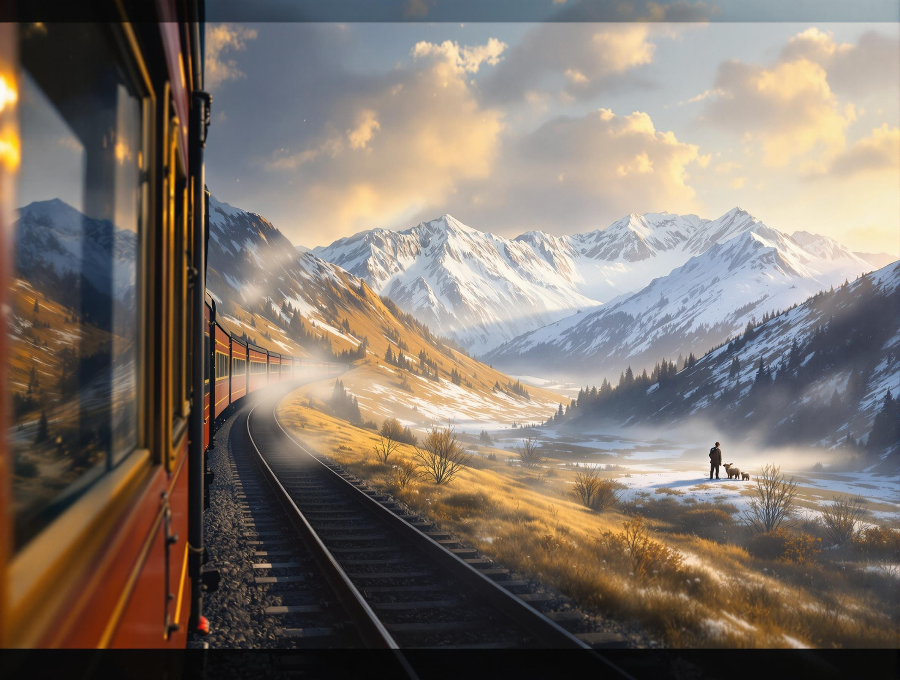

# 羅馬尼亞的迷霧

---

貝爾格勒的電軌馬車在細雨中顛簸，車輪磨擦著潮濕的鵝卵石街道，發出規律的哐啷聲響。我正把打字機上卡住的最後一個「R」字母用力拔出來，指尖沾染了陳年墨水留下的污漬。窗外一九一三年的春日帶著一絲哈布斯堡王朝末年的腐朽氣息，混雜著印刷廠油墨與紙張的氣味，一同湧入《週日怪聞報》那間狹小而雜亂的編輯部。身為全塞爾維亞最不入流報社的「資深」記者，博斯科早已習慣用鋼筆應付那些讀者愛看，卻毫無價值的奇聞軼事，像是「會跳舞的公雞」或是「能預知未來的貓」。我的報導生涯，早已在無數篇荒誕不經的「獨家內幕」中被消磨殆盡。

「博斯科，快來看看這個！」隔壁桌的德拉甘又在鬼吼鬼叫，他那台老舊的雷明頓打字機噠噠作響，彷彿敲打著我的太陽穴。「瓦拉幾亞古堡鬧鬼了！聽說是吸血鬼德古拉伯爵的鬼魂作祟！」德拉甘總是能輕易編造出各種聳人聽聞的鬼故事，他堅信讀者就是愛看這些無腦的東西。而主編也樂於刊登這些「符合報社風格」的報導。

我揉了揉發脹的太陽穴，拿起德拉甘丟過來的校樣稿。《吸血鬼古堡午夜驚魂》、《喀爾巴阡山區狼人傳說》、《幽靈馬車再度現身》，標題一個比一個聳動誇張。這已經是本週第三篇關於蒸汽火車會在月圓之夜駛入地底的鬼扯報導。指尖沾上的廉價黑色墨水隱約透著一絲詭異的紅，我分不清那是上週校對「吸血鬼特輯」時不小心沾到的紅墨水，還是這份該死的職業病早已深入我的骨髓，讓我眼中所見之物都帶上了一層不祥的血色。

「怎麼，我們的新聞界諾斯特拉達穆斯又在為人類的集體愚蠢感到悲嘆了嗎？」主編叼著他那根永遠燒到一半的雪茄，推開磨砂玻璃門走了進來。他總是喜歡用這種挖苦的語氣跟我說話。我放下手中的校樣稿，轉身指了指桌上攤開的城市地圖，那是我正在研究的多瑙河新鐵橋工程草圖。「主編，我認為這個鐵橋的興建，將會徹底改變巴爾幹半島的戰略格局。這才是真正值得報導的大新聞，具有世界性的影響力！」我試圖說服他，放棄那些無聊的超自然報導。

主編走到我的桌前，拿起草圖掃了一眼，隨即發出一陣老人特有的渾濁笑聲，笑聲中帶著尼古丁的苦澀與嘲諷。「博斯科，我的年輕的理想主義者啊，你總是對『世界性的影響力』抱持著不切實際的幻想。」他用指節敲了敲桌面，示意我面對現實。「讀者想看的是神怪故事，不是冰冷的鋼筋水泥。那些政客和軍閥的勾心鬥角，離我們這些小人物太遙遠了。我們要做的，是滿足讀者的好奇心，讓他們在廉價的刺激中忘卻生活的苦悶。」

「但那些都是假的！」我忍不住提高了音量，語氣中帶著一絲自己也察覺到的挫折。「那些吸血鬼、狼人、幽靈火車，全都是德拉甘那種騙子編造出來的謊言！我們是記者，不是說書人！」

主編聳了聳肩，走到窗邊，吐出一口濃烈的煙霧，讓廉價菸草的味道瀰漫在空氣中。「在這個國家，真相值幾個錢？博斯科，你要學會睜一隻眼閉一隻眼。太過認真，你會活得很痛苦的。」他轉過身，眼中帶著一絲我無法理解的複雜情緒。「而且，誰說那些都是假的呢？這個世界上，總有一些我們無法解釋的事情。」

他彈了彈手中的雪茄灰，像是下定決心似的說道：「收拾好你的採訪工具，博斯科。你的顯影藥水和柯達相機該派上用場了。明早的東方快車會載你去見證真正的古代神蹟。」說著，他從公事包裡拿出一個牛皮紙文件袋，丟在堆滿咖啡漬的桌布上。文件袋的羊皮紙封面上，印著燙金的雙頭鷹徽記。「羅馬尼亞考古學會在特蘭西瓦尼亞發現了一處達契亞時期的祭壇遺址，上面刻著一些連布加勒斯特大學的教授都無法破解的古代符文。報社替你爭取到了一個特別採訪的機會。」

我拿起文件袋，抽出裡面的資料，那些影印的照片上，是一些狀似鷹爪抓痕的奇怪符號，看起來就像是隨意刻在石頭上的鬼畫符。我不屑地冷笑一聲：「所以，這次我們要編造什麼？古達契亞惡靈復活？還是要讓某位瓦拉幾亞的伯爵從棺材裡爬出來配合演出？好讓德拉甘那個騙子再寫上三個月的連載？」

「你還是這麼天真得可愛，我的塞爾維亞唐吉軻德。」主編走到牆邊，指著牆上那張老舊的奧斯曼帝國古地圖，地圖上巴爾幹半島的輪廓模糊不清，像是被歷史的塵埃所掩蓋。「當整個歐洲都在用望遠鏡凝望未來，忙著預測下一次工業革命和世界大戰爆發的時間，總要有一些像你這樣的傻瓜，拿著放大鏡在歷史的裂縫裡翻找一些古老的童話故事，不是嗎？」他忽然用雪茄重重地按住其中一張照片上某個模糊的圓形刻痕，原本漫不經心的語氣也變得凝重起來。「更何況…」他壓低聲音，彷彿在說什麼秘密似的。「聽說德國考古學會也對這個祭壇遺址很感興趣，他們也派了代表前往特蘭西瓦尼亞。」

德國人？這倒是讓我感到有些意外。那些嚴謹的德國學者，也會對這種神神鬼鬼的東西感興趣？難道這次的「古代神蹟」，並不像我想像的那麼簡單？

「總之，這趟羅馬尼亞之行，就當作是報社犒賞你的免費假期吧。」主編拍了拍我的肩膀，露出一抹意味深長的笑容。「放鬆心情，享受一下異國風情。說不定，你會在那裡找到一些…意想不到的『靈感』。」

我拿起桌上的柯達布朗尼相機，塞進老舊的皮革製攝影包裡。好吧，既然主編都這麼說了，就當作是一趟免費的旅行好了。反正待在貝爾格勒這種鬼地方，每天面對那些無聊的「超自然新聞」，我也早就膩了。去羅馬尼亞看看也好，說不定那裡的風景還不錯。至於什麼古代祭壇，什麼神秘符文，我壓根兒不相信。不過，既然德國佬也去了，或許可以去那邊挖點別的新聞，寫一些真正有價值的報導，也好過在這裡浪費時間。

就這樣，我帶著半信半疑的心情，以及一絲對免費旅行的期待，開始收拾行李，準備前往那個充滿神秘色彩的國度——羅馬尼亞。東方快車的汽笛聲，即將在貝爾格勒車站響起，帶我駛向喀爾巴阡山脈深處，駛向一個充滿未知與可能性的旅程。

列車駛入喀爾巴阡山隘，清晨的陽光將遠方的雪山染成一片蜂蜜般的金色。車輪與鐵軌規律撞擊的聲音，在空曠的山谷間迴盪，那單調而重複的節奏，竟與報社印刷機運轉時的聲音詭異地重合起來。我望著手提箱裡那疊空白的信紙，思緒有些飄忽。透過柯達布朗尼相機簡陋的取景框，我捕捉到一個牧羊人趕著羊群，鑽入古道間瀰漫的薄霧之中的畫面——多麼完美的「通往異世界之門」的素材啊，這景象要是被德拉甘那個騙子看到，肯定又能編出一個連載三週的鬼故事。

<i>攝於喀爾巴阡山隘
